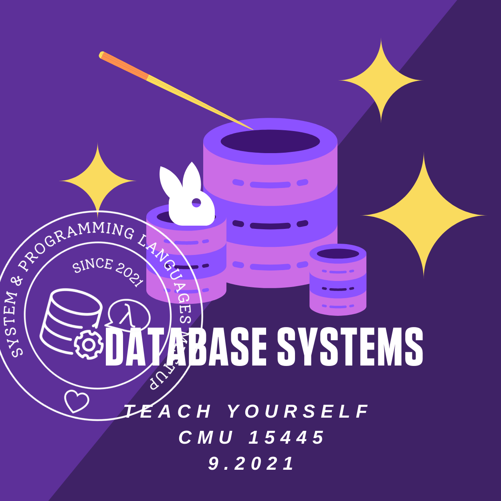
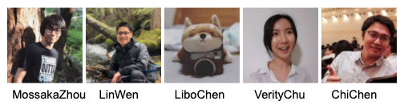

# 21' Database Meetup by SPLVM

## Annoucement:

1. **9/22/2021:** Our first *database meetup* will start on Saturday, September 25th, 2021 at 5:00PM.
   [Zoom](https://zoom.us/j/98807003493?pwd=YUhvZ3pUQy85MkhtZzVSaFZBL1k4dz09)
2. Our upcoming future meetups will be hosted every Saturday at 4:30 PM.
3. **10/2/2021:** Our second *database meetup* will start on Saturday, Oct 2nd, 2021 at 4:30PM PST. Verity will cover Database System Concepts chap 1 and 3.1-3.7. 
4. **11/6/2021:** We covered Lecture 3 to answer the question: how does the DBMS represent database in files on disk? We covered different storage medias, such as disk, SSD and cache. We also covered the heap file layout: linkedin list vs. page directory. Lastly, we covered the page layout and discussed the pros and cons of slotted page vs. log-structured file organizations. For next week: we will continue out journey on the database disk management and will talk about tuple layout, data representation, and OLTP vs. OLAP models. 
5. **11/13/2021:** We covered Lecture 4, the sequal to the last lecture about the database storage. Particularly, we went through how tuples are organized in disk, different data representations, what is database catelog and different databsae storage models corresponding to OLAP and OLTP worklaods. Next week, Libo will host the discussion for Lecture 5 & 6 - Buffer Pools and Hash Tables.
6. **11/21/2021:** We covered Lecture 5 and 6, the Buffer Pool and Hash Tables. Next week is the Thanksgiving holiday so we will not meet online. Have a good weekend everyone! We will be back on December and Verity will be presenting Tree Indexes on Dec. 4th. 
7. **12/6/2021:** We covered Lecture 7 and 8, the Tree Indexes. Next week, we invited [Bohan Zhang](https://www.linkedin.com/in/bohan-zhang-52b17714b/), Co-founder of Ottertune, to give us a guest talk about Ottertune. If you are interested, please read the following papers to get a background on what Ottertune is: 
   - [Automatic Database Management System Tuning Through Large-scale Machine Learning](https://www.cs.cmu.edu/~pavlo/papers/p1009-van-aken.pdf)
   - [A Demonstration of the OtterTune Automatic Database Management System Tuning Service](http://www.vldb.org/pvldb/vol11/p1910-zhang.pdf)
   - [An Inquiry into Machine Learning-based Automatic Configuration Tuning Services on Real-World Database Management Systems](https://www.cs.cmu.edu/~pavlo/papers/p1241-aken.pdf)

## Schedule

Click [here](https://docs.google.com/spreadsheets/d/e/2PACX-1vTQYCQvUXoG0_C8hJgf9l-UddUZGxIxbLqPOrbGQGpSbl4n1D6tRzXFqZwl9fZCo-Dcn2RCE6W_1oRY/pubhtml)

## Resources

- [Schedule](https://docs.google.com/spreadsheets/d/e/2PACX-1vTQYCQvUXoG0_C8hJgf9l-UddUZGxIxbLqPOrbGQGpSbl4n1D6tRzXFqZwl9fZCo-Dcn2RCE6W_1oRY/pubhtml?gid=242293822&single=true)
- [Zoom](https://us06web.zoom.us/j/88313732922?pwd=QzVDVDc4NU1adGtzZWRxWlhmNTdFQT09)
- [CMU 15.445 Fall 2019 Course](https://15445.courses.cs.cmu.edu/fall2019/schedule.html)
- [Textbook: Database System Concepts 6th Edition](https://www.db-book.com/db6/)
- [Slack workspace](https://join.slack.com/t/splvm/shared_invite/zt-vhy0ld9w-xZ23aoJBzDb2CRvq8do~aQ)

## The Team

## Meetup Recordings

1. [Meetup 0](https://youtu.be/j_ndKUIIOkI)
2. [Meetup 1](https://youtu.be/uy5OHxU7v9U)
3. [Meetup 2](https://youtu.be/3iX8nwBkuT4)
4. [Meetup 3 part I](https://youtu.be/lzT9SKWC1YU)
5. [Meetup 3 part II](https://youtu.be/_BXK8I7PfnU)
6. [Guest talk: Spanner](https://youtu.be/Mf2JWbRV1j8)
7. [Meetup 4](https://youtu.be/iPNeNGqMuw0)
8. [Meetup 5](https://youtu.be/RSUmAGvDdLQ)
9. [Meetup 6](https://youtu.be/Wk1UQgKKm78)
10. [Meetup 7](https://www.youtube.com/watch?v=UrvVQBg5-bY)
11. [Meetup 8](https://youtu.be/yzt0W8HxpMk)

## Previous Distributed System Meetup
Click [here](https://microsoft-distributed-system-meetup.github.io/distsys-meetup/)
