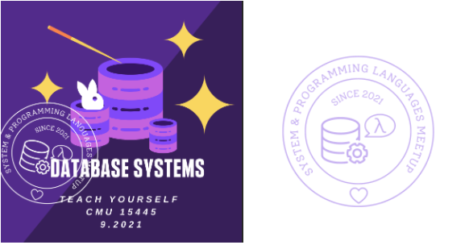

# 21' Database Meetup by SPLVM

## Annoucement:

1. 9/22/2021: Our first *database meetup* will start on Saturday, September 25th, 2021 at 5:00PM.
   [Zoom](https://zoom.us/j/98807003493?pwd=YUhvZ3pUQy85MkhtZzVSaFZBL1k4dz09)
2. Our upcoming future meetups will be hosted every Saturday at 4:30 PM.

## Schedule

<iframe src="https://docs.google.com/spreadsheets/d/e/2PACX-1vTQYCQvUXoG0_C8hJgf9l-UddUZGxIxbLqPOrbGQGpSbl4n1D6tRzXFqZwl9fZCo-Dcn2RCE6W_1oRY/pubhtml?widget=true&headers=false" frameborder="0" width="800" height="600" allowfullscreen="true" mozallowfullscreen="true" webkitallowfullscreen="true"></iframe>

## Resources

- [Schedule](https://docs.google.com/spreadsheets/d/e/2PACX-1vTQYCQvUXoG0_C8hJgf9l-UddUZGxIxbLqPOrbGQGpSbl4n1D6tRzXFqZwl9fZCo-Dcn2RCE6W_1oRY/pubhtml?gid=242293822&single=true)
- [Zoom](https://zoom.us/j/98807003493?pwd=YUhvZ3pUQy85MkhtZzVSaFZBL1k4dz09)
- [CMU 15.445 Fall 2019 Course](https://15445.courses.cs.cmu.edu/fall2019/schedule.html)
- [Textbook: Database System Concepts 6th Edition](https://www.db-book.com/db6/)
- [Slack workspace](https://join.slack.com/t/splvm/shared_invite/zt-vhy0ld9w-xZ23aoJBzDb2CRvq8do~aQ)

## The Team

## Meetup Recordings

[Checkout our Youtube channel!](https://www.youtube.com/channel/UC4PdxvOPm_G7hNWWmhFFsfQ)
